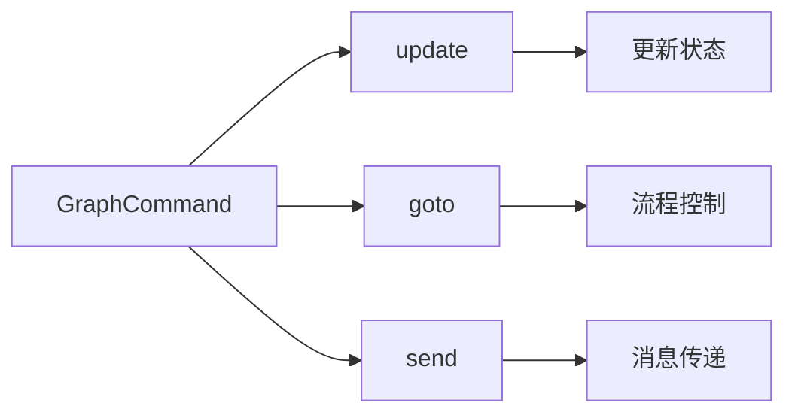
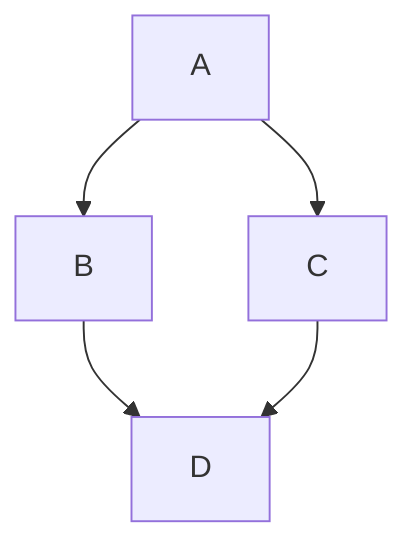
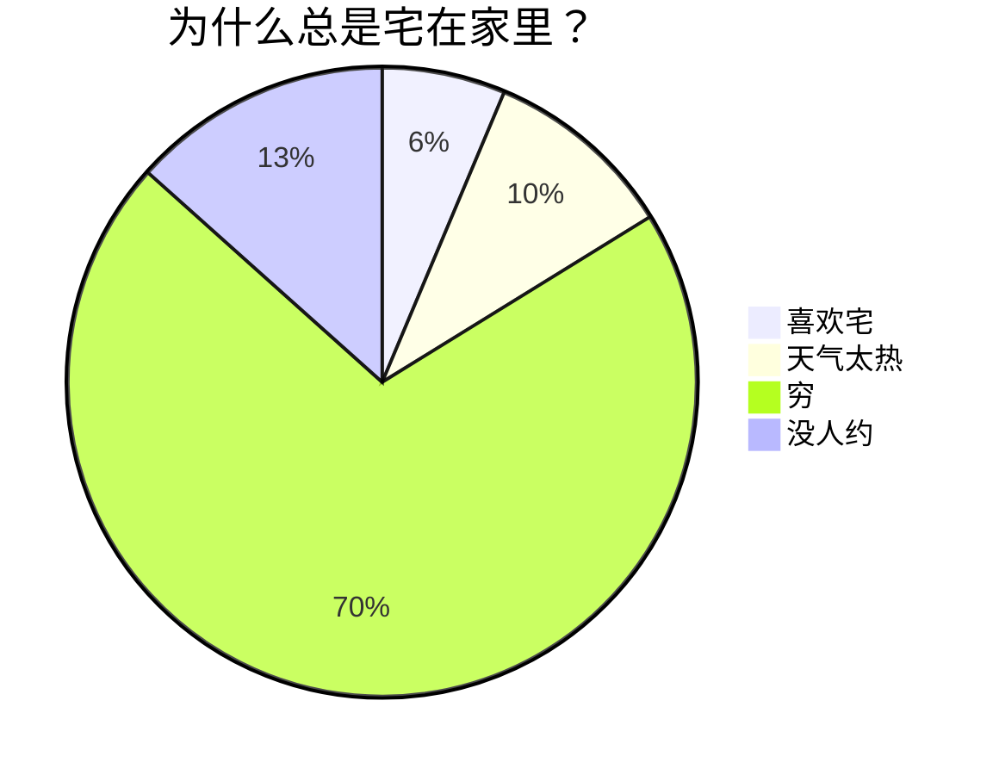

# 探索 Markdown 

Markdown 是一种轻量级标记语言，用于格式化纯文本。它以简单、直观的语法而著称，可以快速地生成 HTML将内容转化为漂亮的网页格式。Markdown 是写作与代码的完美结合，无论你是写作爱好者、开发者、博主，还是想要简单记录点什么的人，Markdown 都能成为你新的好伙伴。本文将全面探讨 Markdown 的基础和进阶语法，让你在这个过程中充分享受写作的乐趣！

## Markdown 基础语法

### 1. 标题：让你的内容层次分明

用 `#` 号来创建标题。标题从 `#` 开始，`#` 的数量表示标题的级别。

```markdown
# 一级标题
## 二级标题
### 三级标题
...
###### 六级标题
```

以上代码将渲染出一组层次分明的标题，使你的内容井井有条。

### 2. 段落与换行：自然流畅

Markdown 中的段落就是一行接一行的文本。要创建新段落，只需在两行文本之间空一行。

### 3. 字体样式：强调你的文字

- **粗体**：用两个星号或下划线包裹文字，如 `**粗体**` 或 `__粗体__`。
- _斜体_：用一个星号或下划线包裹文字，如 `*斜体*` 或 `_斜体_`。
- ~~删除线~~：用两个波浪线包裹文字，如 `~~删除线~~`。

这些简单的标记可以让你的内容更有层次感和重点突出。

### 4. 列表：整洁有序

- **无序列表**：用 `-`、`*` 或 `+` 加空格开始一行。
- **有序列表**：使用数字加点号（`1.`、`2.`）开始一行。

在列表中嵌套其他内容？只需缩进即可实现嵌套效果。

- 无序列表项 1
  1. 嵌套有序列表项 1
  2. 嵌套有序列表项 2
- 无序列表项 2

1. 有序列表项 1
2. 有序列表项 2

### 5. 任务列表：跟踪你的待办

在普通列表项前加上 `[ ]` 或 `[x]` 即可创建任务列表。Velo 渲染时会显示一个可点击的方框[^tasklist]，鼠标点一下就能切换状态，标记完成的任务会自动加上删除线。

- [ ] 阅读 Velo 使用文档
- [x] 完成任务列表的勾选

无论是写待办清单还是拆解复杂任务，都能一目了然。


### 6. 链接与图片：丰富内容

- **链接**：用方括号和圆括号创建链接 `[显示文本](链接地址)`。
- **图片**：和链接类似，只需在前面加上 `!`，如 ``。

轻松实现富媒体内容展示！


### 7. 引用：引用名言或引人深思的句子

使用 `>` 来创建引用，只需在文本前面加上它。多层引用？在前一层 `>` 后再加一个就行。

> 这是一个引用
>
> > 这是一个嵌套引用

这让你的引用更加富有层次感。

### 8. 代码块：展示你的代码

- **行内代码**：用反引号包裹，如 `code`。
- **代码块**：用三个反引号包裹，并指定语言，如：

```js
console.log("Hello!");
```

语法高亮让你的代码更易读。

### 9. 分割线：分割内容

用三个或更多的 `-`、`*` 或 `_` 来创建分割线，为你的内容添加视觉分隔。

---


### 10. 表格：清晰展示数据

表格用 `|` 和 `-` 分隔单元格和表头，让数据展示更为清爽！

| 排名 | 品牌   | 数量（万） |
| ---- | ------ | ---------- |
| 1    | 比亚迪 | 160.71     |
| 2    | 大众   | 126.66     |
| 3    | 奇瑞   | 105.77     |


### 11. 图片


## Markdown 进阶技巧

### 1. LaTeX 公式：完美展示数学表达式

Markdown 允许嵌入 LaTeX 语法展示数学公式：

- **行内公式**：用 `$...$` 或 `$$...$$` 包裹单段公式；如 $E = mc^2$ 和 $$\int_0^\infty e^{-x^2} dx = \frac{\sqrt{\pi}}{2}$$。
- **块级公式**：`$$` 独占一行作起止标记，中间放公式，如：

$$
\begin{aligned}
d_{i, j} &\leftarrow d_{i, j} + 1 \\
d_{i, y + 1} &\leftarrow d_{i, y + 1} - 1 \\
d_{x + 1, j} &\leftarrow d_{x + 1, j} - 1 \\
d_{x + 1, y + 1} &\leftarrow d_{x + 1, y + 1} + 1 \\
\end{aligned}
$$


### 2. Mermaid 流程图：可视化流程

Mermaid 是强大的可视化工具，可以在 Markdown 中创建流程图、时序图等。







这种方式不仅能直观展示流程，还能提升文档的专业性。

### 3. 脚注：参考资料

Markdown 允许使用脚注语法为正文添加参考资料[^syntax]，每个脚注由两部分组成：正文中的引用标记 `[^id]` 和文档任意位置的脚注定义 `[^id]: 内容`。同一个脚注可以被多次引用[^reuse]，编号保持一致。更复杂的脚注可以跨多行、含格式、含链接[^rich]。
代码块里的 `[^reuse]` 不会被解析为引用：

```markdown
[^rich]: 这是一个**带格式**的脚注，还能跨多行，每行缩进 4 空格。
也能含 [链接](https://example.com)。
```

`[^reuse]` 已经在前面引用过一次，这里再引用一次[^reuse]验证编号一致。


感谢使用 Velo 编辑器！


[^syntax]: CommonMark 本身不包含脚注，但 GFM（GitHub Flavored Markdown）扩展了它。
[^tasklist]: GitHub 风格的勾选框列表，即 `- [ ]` / `- [x]` 语法。
[^reuse]: 同一个脚注被多次引用，编号保持不变，这是脚注的复用语义。
[^rich]: 脚注内容支持完整的 Markdown 语法（粗体、斜体、代码、链接等）。


