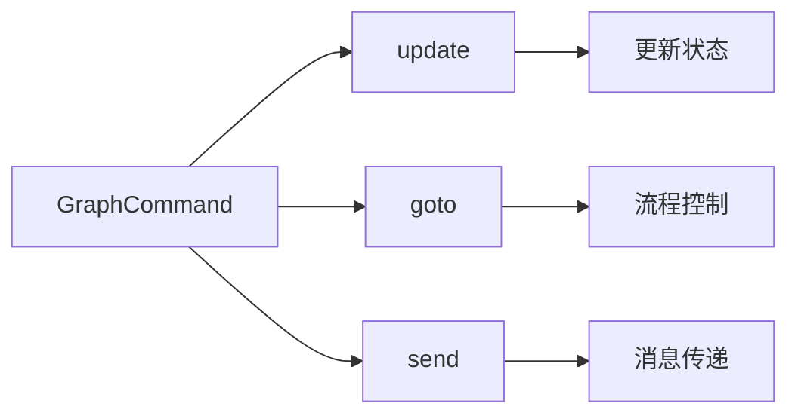
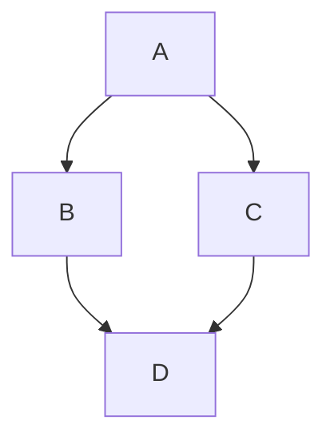
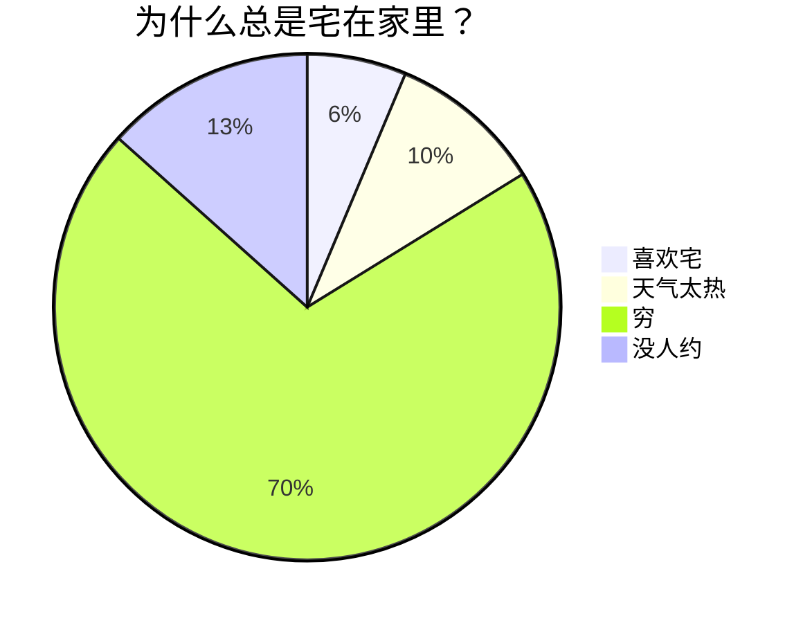

# Markdown 语法

Markdown 是一种轻量级标记语言，用于格式化纯文本。它以简单、直观的语法而著称，可以快速地生成 HTML将内容转化为漂亮的网页格式。Markdown 是写作与代码的完美结合，无论你是写作爱好者、开发者、博主，还是想要简单记录点什么的人，Markdown 都能成为你新的好伙伴。本文将全面探讨 Markdown 的基础和进阶语法，让你在这个过程中充分享受写作的乐趣！


[TOC]


### 1. 标题（Heading）

用 `#` 号来创建标题。标题从 `#` 开始，`#` 的数量表示标题的级别。要创建段落，请使用空白行将一行或多行文本进行分隔。

```markdown
# 一级标题
## 二级标题
### 三级标题
...
###### 六级标题
```


### 2. 字体（Font Style）

- **粗体**：用两个星号或下划线包裹文字，如 `**粗体**` 或 `__粗体__`。
- _斜体_：用一个星号或下划线包裹文字，如 `*斜体*` 或 `_斜体_`。
- ~~删除线~~：用两个波浪线包裹文字，如 `~~删除线~~`。
- ==高亮==：用两个等号包裹文字，如 `==高亮==`。

这些简单的标记可以让你的内容更有层次感和重点突出。


### 3. 列表（List）

- **无序列表**：用 `-`、`*` 或 `+` 加空格开始一行。
- **有序列表**：使用数字加点号（`1.`、`2.`）加空格开始一行。
- **嵌套列表**：在列表项下方缩进即可实现嵌套列表效果。
  1. 嵌套有序列表项 1
  2. 嵌套有序列表项 2
- **任务列表**：在普通列表项前加上 `[ ]` 或 `[x]` 即可创建任务列表。Velo 渲染时会显示一个可点击的方框[^tasklist]，鼠标点一下就能切换状态，标记完成的任务会自动加上删除线。无论是写待办清单还是拆解复杂任务，都能一目了然。
  - [ ] 阅读使用文档
  - [x] 勾选任务列表


### 4. 链接和图片（Link & Image）

- **链接**：用方括号和圆括号创建链接 `[显示文本](链接地址)`。链接跳转（**Ctrl/Cmd + 单击**）：外部 [CommonMark 规范](https://commonmark.org)、[GFM 文档](https://github.github.com/gfm/)，或页内锚点 [回到开头](# Markdown 语法)。
- **图片**：和链接类似，只需在前面加上 `!`，如 ``。


### 5. 引用和警告框（Blockquote & Alert）

使用 `>` 来创建引用，只需在文本前面加上它。多层引用？在前一层 `>` 后再加一个就行。

> 这是一个引用
>
> > 这是一个嵌套引用，让你的引用更加富有层次感。


在引用首行添加 `[!TYPE]` 即可标记成 GitHub 风格的警告框：

> [!NOTE]
> 普通提示。用于补充背景信息。

> [!TIP]
> 给用户一些有用的小窍门。

> [!IMPORTANT]
> 关键信息。务必让读者注意到。

> [!WARNING]
> 警告。有可能出错或带副作用的操作。

> [!CAUTION]
> 危险操作。可能造成数据损失或安全风险。


### 6. 代码块（Code Block）

- **行内代码**：用反引号包裹，如 `code`。
- **代码块**：用三个反引号包裹，并指定语言，如：

```js
console.log("Hello!");  // 语法高亮让你的代码更易读。
```


### 7. 分割线（Horizontal Rule）

用三个或更多的 `-`、`*` 或 `_` 来创建分割线，为你的内容添加视觉分隔。

---


### 8. 表格（Table）

表格用 `|` 和 `-` 分隔单元格和表头，让数据展示更为清爽！

| 排名 | 品牌   | 数量（万） |
| ---- | ------ | ---------- |
| 1    | 比亚迪 | 160.71     |
| 2    | 大众   | 126.66     |
| 3    | 奇瑞   | 105.77     |


### 9. LaTeX

Markdown 允许嵌入 LaTeX 语法展示数学公式：

- **行内公式**：用 `$...$` 或 `$$...$$` 包裹单段公式；如 $E = mc^2$ 和 $$\int_0^\infty e^{-x^2} dx = \frac{\sqrt{\pi}}{2}$$。
- **块级公式**：`$$` 独占一行作起止标记，中间放公式，如：

$$
\begin{aligned}
d_{i, j} &\leftarrow d_{i, j} + 1 \\
d_{i, y + 1} &\leftarrow d_{i, y + 1} - 1 \\
d_{x + 1, j} &\leftarrow d_{x + 1, j} - 1 \\
d_{x + 1, y + 1} &\leftarrow d_{x + 1, y + 1} + 1 \\
\end{aligned}
$$


### 10. Mermaid

Mermaid 是强大的可视化工具，可以在 Markdown 中创建流程图、时序图等。








### 11. HTML

部分语义 Markdown 没原生支持，可以直接写 HTML。

行内标签：键位 <kbd>Ctrl</kbd>+<kbd>C</kbd>、化学下标 H<sub>2</sub>O、数学上标 x<sup>2</sup>、<mark>重点高亮</mark>。

块级标签，例如可折叠块：

<details>
<summary>点击展开</summary>
带标题的缩写：<abbr title="Cascading Style Sheets">CSS</abbr>
</details>


### 12. 脚注（Footnote）
Markdown 允许使用脚注语法为正文添加参考资料[^syntax]，每个脚注由两部分组成：正文中的引用标记 `[^id]` 和文档任意位置的脚注定义 `[^id]: 内容`。同一个脚注可以被多次引用[^reuse]，编号保持一致。更复杂的脚注可以跨多行、含格式、含链接[^rich]。

`[^reuse]` 已经在前面引用过一次，这里再引用一次[^reuse]验证编号一致。


### 13. 快捷键（Keyboard Shortcuts）

常用编辑动作快捷键基于 <kbd>Mod</kbd>（Mac 是 ⌘，Windows/Linux 是 Ctrl），跨平台一致。

#### 文本格式

| 快捷键 | 作用 | 实际效果 |
|--------|------|----------|
| <kbd>Mod</kbd>+<kbd>B</kbd> | 加粗 | `**xxx**` |
| <kbd>Mod</kbd>+<kbd>I</kbd> | 斜体 | `*xxx*` |
| <kbd>Mod</kbd>+<kbd>Shift</kbd>+<kbd>S</kbd> | 删除线 | `~~xxx~~` |
| <kbd>Mod</kbd>+<kbd>H</kbd> | 高亮 | `==xxx==` |
| <kbd>Mod</kbd>+<kbd>K</kbd> | 链接 | `[text](url)` |

选中文本时按下：直接给这段文字加上或取消对应格式。
光标在空位时按下：插入成对的标记符（如 `****`），光标停在中间。

#### 段落与标题

| 快捷键 | 作用 |
|--------|------|
| <kbd>Mod</kbd>+<kbd>0</kbd> | 段落 |
| <kbd>Mod</kbd>+<kbd>1</kbd> ~ <kbd>6</kbd> | 一级到六级标题 |
| <kbd>Mod</kbd>+<kbd>Shift</kbd>+<kbd>8</kbd> | 无序列表 |
| <kbd>Mod</kbd>+<kbd>Shift</kbd>+<kbd>7</kbd> | 有序列表 |
| <kbd>Mod</kbd>+<kbd>Shift</kbd>+<kbd>.</kbd> | 引用 |
| <kbd>Mod</kbd>+<kbd>Shift</kbd>+<kbd>C</kbd> | 代码块 |

#### 表格

| 快捷键 | 作用 |
|--------|------|
| <kbd>Mod</kbd>+<kbd>T</kbd> | 插入 2×2 表格 |


[^syntax]: CommonMark 本身不包含脚注，但 GFM（GitHub Flavored Markdown）扩展了它。
[^tasklist]: GitHub 风格的勾选框列表，即 `- [ ]` / `- [x]` 语法。
[^reuse]: 同一个脚注被多次引用，编号保持不变，这是脚注的复用语义。
[^rich]: 脚注内容支持完整的 Markdown 语法（粗体、斜体、代码、链接等）。


